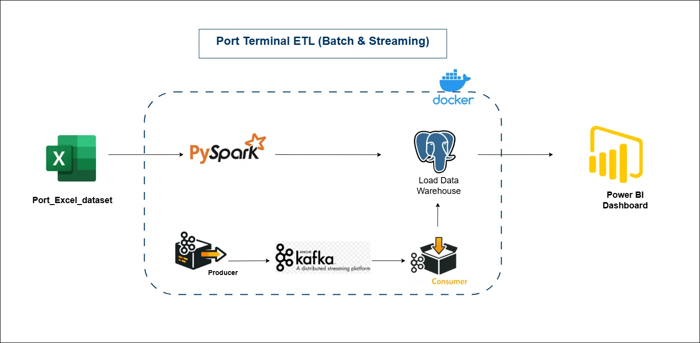
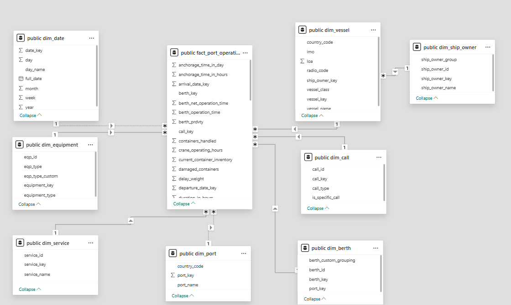

# port_Terminal_ETL_Pipline
# Port KPI Data Platform Architecture (Batch + Streaming)

A professional, enterprise-grade data platform for ingesting, transforming, storing, and analyzing Port KPI data using both **Batch ETL** and **Real-Time Streaming pipelines**. This platform is designed following modern **Data Engineering best practices**, including **Star Schema modeling**, **containerized services**, and **interactive dashboards**.

---

# Data Pipeline Architecture



---

# Dashboard Overview
Dashboard Link: https://app.powerbi.com/view?r=eyJrIjoiMGY5M2FhNWMtZjYxZi00MDhlLWE4NjAtZjJlZmQxODc2YzNjIiwidCI6ImVhZjYyNGM4LWEwYzQtNDE5NS04N2QyLTQ0M2U1ZDc1MTZjZCIsImMiOjh9


---

# Data Modeling (Star Schema)



---

# Architecture Overview

This system integrates two parallel pipelines:

* **Batch ETL Pipeline** → Processes historical Excel data using PySpark  
* **Streaming Pipeline** → Processes real-time events using Kafka  
* **Central Data Warehouse** → PostgreSQL with Star Schema  
* **Analytics Layer** → Power BI dashboards  
* **Containerized Environment** → Docker Compose  

---

# Key Features

* Batch ETL using PySpark  
* Real-time streaming using Apache Kafka  
* PostgreSQL Star Schema Data Warehouse  
* Dockerized infrastructure  
* Power BI analytics dashboards  
* Scalable and production-ready architecture  
* Clean separation between batch and streaming pipelines  

---

# Technology Stack

| Layer            | Technology             |
|------------------|------------------------|
| Data Source      | Excel (.xlsx)          |
| Batch Processing | PySpark, Python        |
| Streaming        | Apache Kafka, Python   |
| Database         | PostgreSQL             |
| Containerization | Docker, Docker Compose |
| Analytics        | Power BI               |
| Language         | Python 3.11+           |

---

# Data Architecture

## Star Schema Design

### Fact Table

```
fact_port_operations
```

### Dimension Tables

```
dim_date
dim_vessel
dim_ship_owner
dim_port
dim_berth
dim_service
dim_call
dim_equipment
```

This design enables fast analytics and efficient dashboard queries.

---

# Batch ETL Pipeline

## Flow

```
Excel → PySpark → PostgreSQL
```

## Responsibilities

* Read Excel dataset
* Clean and validate data
* Transform into Star Schema
* Load into PostgreSQL warehouse

## Location

```
etl/
  batch_etl.py
```

## Run

```
python etl/batch_etl.py
```

---

# Real-Time Streaming Pipeline

## Flow

```
Kafka Producer → Kafka Broker → Kafka Consumer → PostgreSQL
```

## Producer

Generates fake real-time Port KPI data

```
streaming/producer.py
```

Run:

```
python streaming/producer.py
```

---

## Consumer

Consumes Kafka events and inserts into PostgreSQL

```
streaming/consumer.py
```

Run:

```
python streaming/consumer.py
```

---

# Database Layer

PostgreSQL acts as the central Data Warehouse.

## Connection

```
Host: localhost
Port: 5432
Database: port_kpi
User: postgres
Password: postgres
```

---

# Docker Environment

All services run inside Docker:

* PostgreSQL
* Kafka
* Zookeeper
* PySpark ETL
* Kafka Producer
* Kafka Consumer

## Start environment

```
docker-compose up -d
```

## Stop environment

```
docker-compose down
```

---

# Project Structure

```
port-kpi-data-platform/
│
├── etl/
│   └── batch_etl.py
│
├── streaming/
│   ├── producer.py
│   └── consumer.py
│
├── database/
│   └── schema.sql
│
├── docker/
│   └── docker-compose.yml
│
├── data/
│   └── port_kpi.xlsx
│
├── docs/
│   └── architecture.png
│
└── README.md
```

---

# Analytics Layer (Power BI)

Power BI connects directly to PostgreSQL.

## Connection Type

```
PostgreSQL Connector
```

## Use Cases

* Vessel turnaround time
* Port utilization
* Equipment performance
* Operational KPIs
* Real-time monitoring dashboards

---

# Data Flow Summary

## Batch Flow

```
Excel → PySpark → PostgreSQL
```

## Streaming Flow

```
Producer → Kafka → Consumer → PostgreSQL
```

## Analytics Flow

```
PostgreSQL → Power BI
```

---

# How to Run Full System

## Step 1: Start Docker

```
docker-compose up -d
```

## Step 2: Run Batch ETL

```
python etl/batch_etl.py
```

## Step 3: Start Streaming Producer

```
python streaming/producer.py
```

## Step 4: Start Streaming Consumer

```
python streaming/consumer.py
```

## Step 5: Open Power BI Dashboard

Connect to PostgreSQL and build visualizations.

---

# Use Cases

* Port performance monitoring
* Real-time operational analytics
* Historical trend analysis
* KPI dashboards
* Data engineering portfolio projects
* Thesis and academic demonstrations

---

# Production-Grade Design Principles

* Star Schema Warehouse
* Separation of batch and streaming
* Containerized microservices
* Scalable architecture
* Fault-tolerant streaming
* Enterprise-ready design
